# Projet P6 - MDD Full Stack

## Table des matières

- [Préalables](#préalables)
- [Introduction](#introduction)
- [Préalables d'installation](#préalables-dinstallation)
    - [Pré-requis](#pré-requis)
    - [Installation option 1](#installation-option-1-la-plus-rapide--installation-via-le-pom-multi-modules-maven-avec-profils-prodlocal-et-docker-image)
    - [Installation option 2](#installation-option-2--installation-classique-pour-le-développement)
        - [Installation de la base de données](#installation-de-la-base-de-données-postgresql-depuis-docker-compose)
        - [Exécution de l'application](#exécution-de-lapplication-sur-le-poste-de-dev)
- [Sécurité renforcée et meilleures pratiques](#sécurité-renforcée-et-meilleures-pratiques)
- [Configuration Reverse Proxy](#configuration-reverse-proxy)
- [Technologies et bonnes pratiques appliquées](#technologies-et-bonnes-pratiques-appliquées)
    - [Automatisation des installations](#automatisation-des-installations-et-déploiements-avec-docker-et-docker-compose)
    - [Gestion automatisée des migrations](#gestion-automatisée-des-migrations-de-données-avec-flyway)
    - [Backend avec SpringBoot](#backend-avec-springboot-344-et-spring-webflux)
        - [Mise à jour instantanée](#mise-à-jour-instantanée-sse--server-send-event)
        - [Sécurité basée sur OAuth2](#sécurité-basée-sur-oauth2-et-token)
    - [Frontend avec Angular](#frontend-avec-angular-192)
    - [Bonnes pratiques](#bonnes-pratiques)
        - [Gestion des messages](#gestion-des-messages-exceptions-et-erreurs)
        - [Respect rigoureux des principes SOLID](#respect-rigoureux-des-principes-solid)
- [Gestion centralisée des erreurs](#gestion-centralisée-des-erreurs-et-des-messages)
    - [Intérêt d'ApiResult](#intérêt-dapiresult)
- [Scénarios destinés à mettre en valeur l'apport des technologies utilisées](#scénarios-destinés-à-mettre-en-valeur-lapport-des-technologies-utilisées)
    - [Affichez l'application sur 2 navigateurs différents ainsi que sur votre téléphone mobile](#affichez-lapplication-sur-2-navigateurs-différents-ainsi-que-sur-votre-téléphone-mobile-avec-des-logins-différents)
    - [Scénarios d'inscription et de connexions](#scénarios-dinscription-et-de-connexions)
    - [Scénarios d'abonnement / Désabonnement](#scénarios-dabonnement--désabonnement)
    - [Création d'Articles (Posts) et de Commentaires](#création-darticles-posts-et-de-commentaires)
- [Détails de l'architecture de sécurité](#détails-de-larchitecture-de-sécurité)
    - [Serveur d'autorisation vs Ressources](#serveur-dautorisation-vs-serveur-de-ressources-dans-oauth-20)
    - [Utilité de spring-security-oauth2-jose](#utilité-de-la-dépendance-spring-security-oauth2-jose-dans-le-projet-p6mdd)
- [Instructions pour le DevOps](#instructions-pour-le-devops-maven-et-la-gestion-des-commits-gitflow)
    - [Gestion Maven centralisée](#gestion-maven-centralisée)
    - [Directives GitFlow](#directives-gitflow)
    - [Intégration GitFlow et Maven](#intégration-gitflow-et-maven)
- [Auteur et contexte](#auteur-et-contexte)

## Préalables

- En préalable à ce README, je recommande la lecture du [Dossier des choix techniques et d'architecture](https://veille.cpierres.dscloud.me/assets/pdf/choix-techniques-archi-mvp.pdf)
 - Vous pourrez également accéder à mon [site de veille technologique sur les Architectures, Spring et Angular](https://veille.cpierres.dscloud.me/),
depuis la page d'Accueil de ce site, cliquez sur le **Projet P6 - MDD (Client Orion)**

- Application accessible depuis internet : [https://mdd.cpierres.dscloud.me/](https://mdd.cpierres.dscloud.me/)
- Documentation swagger de l'API : [http://apimdd.cpierres.dscloud.me/swagger-ui/index.html](http://apimdd.cpierres.dscloud.me/swagger-ui/index.html)

## Introduction
A la base, l'application présente vise à répondre au cahier des charges du projet 6 MDD d'OpenClassrooms (réseau social MDD : le "Monde Des Développeurs").

Ce projet autorise une liberté concernant les choix des technologies mais doit respecter les maquettes d'écran fournies (pour desktop et mobile) :
[Maquettes Figma (desktop et mobile)](https://www.figma.com/file/Rflr3TVBog35BNMnn0DF09/Maquettes-MDD-(desktop-et-mobile)?node-id=0%3A1)

Il s'agit d'un **MVP** (Minimum Viable Product) devant servir de base du développement complet futur.
Une "base" de développement **se doit d'être solide et performante**. J'ai souhaité vraiment travailler les éléments
qualitatifs pour y parvenir.

Ce projet MVP a peu de fonctionnalités mais celles-ci sont bien pensées car suffisantes pour couvrir la plupart des uses case techniques (relations de 1-1, de 1 à plusieurs, tables d'association) afin de couvrir les mécanismes utiles à mettre en oeuvre.

Ce projet n'aborde pas certains points car non demandés dans les objectifs du MVP :
- pas de gestion du multi-langues
- pas de tests. Ce sujet a déjà été bien développé dans le projet précédent : https://github.com/cpierres/P5-Test-full-stack.
- ces sujets seront néanmoins développés dans une prochaine release !

## Sécurité renforcée et meilleures pratiques

Suite aux remarques de l'évaluateur, la sécurité de l'application a été considérablement renforcée en intégrant les meilleures pratiques de sécurité web :

### Cookies sécurisés avec attributs HttpOnly

- **Cookies HttpOnly** : Les refresh tokens sont stockés dans des cookies avec l'attribut `HttpOnly`, empêchant l'accès via JavaScript et réduisant les risques d'attaques XSS
- **Attribut Secure** : Les cookies sont marqués comme `Secure` en HTTPS, garantissant leur transmission uniquement via des connexions chiffrées
- **Attribut SameSite** : Configuration dynamique de l'attribut SameSite selon le contexte :
  - `SameSite=Strict` pour les connexions HTTPS même-site (sécurité maximale)
  - `SameSite=None` pour les connexions cross-site HTTPS (avec Secure obligatoire)
  - `SameSite=Lax` pour le développement HTTP local (fallback sécurisé)

### Protection CSRF et configuration CORS

- **Désactivation CSRF appropriée** : CSRF désactivé car utilisation de tokens JWT stateless et cookies HttpOnly avec SameSite
- **Configuration CORS stricte** : 
  - Origines autorisées limitées aux domaines de confiance
  - Headers autorisés contrôlés (`Authorization`, `Content-Type`, `Cookie`)
  - Support des credentials pour les cookies HttpOnly (`setAllowCredentials(true)`)
  - Cache des réponses pre-flight optimisé (1 heure)

### Authentification et autorisation renforcées

- **Architecture OAuth2 resource server** : Implémentation du pattern OAuth2 avec serveur de ressources autonome
- **Validation JWT robuste** : Décodage et validation des tokens JWT avec clés secrètes sécurisées
- **Séparation des rôles** : Distinction claire entre serveur d'autorisation (émission tokens) et serveur de ressources (validation tokens)
- **Chiffrement BCrypt** : Mots de passe chiffrés avec l'algorithme BCrypt résistant aux attaques par force brute

## Configuration Reverse Proxy

Les configurations ont été adaptées pour supporter le reverse proxy du NAS cloud, avec prise en charge native des en-têtes forwarded :

### Support des en-têtes forwarded

- **ForwardedHeaderTransformer** : Bean configuré pour traiter automatiquement les en-têtes `X-Forwarded-*` ajoutés par le reverse proxy Nginx
- **Reconnaissance du schéma HTTPS** : Détection automatique du protocole (HTTP/HTTPS) via les en-têtes forwarded pour une configuration correcte des cookies
- **Gestion de l'hôte et du port** : Prise en compte des en-têtes `X-Forwarded-Host` et `X-Forwarded-Port` pour la génération d'URLs correctes

### Configuration Nginx optimisée

- **Headers de proxy standardisés** : Configuration complète des en-têtes de proxy (`X-Real-IP`, `X-Forwarded-For`, `X-Forwarded-Proto`, etc.)
- **Support WebSocket/SSE** : Configuration des timeouts étendus et des en-têtes `Upgrade`/`Connection` pour les Server-Sent Events
- **Gestion HTTPS** : Configuration spécifique pour les connexions HTTPS avec port 443 et SSL activé
- **Timeouts adaptés** : Configuration des timeouts de connexion, lecture et écriture adaptés aux besoins de l'application

Cette approche sécurisée garantit une protection robuste contre les principales vulnérabilités web (XSS, CSRF, attaques de session) tout en maintenant une expérience utilisateur optimale et un support complet des environnements de production avec reverse proxy.

## Préalables d'installation

- Pour être testée, cette application MVP n'a pas besoin d'être installée car déployée sur internet.

- Si néanmoins, vous souhaitez effectuer l'installation sur votre poste de développement, vous avez deux possibilités d'installation :
  - Option 1 : via maven avec pom parent multi-modules (profils : prodlocal et docker-image)
  - Option 2 : installation classique pour le dévelopeur (juste la base en docker) et exécution des modules back et front depuis les sources

Les étapes détaillées sont décrites ci-après.

### Pré-requis
  - Avoir Docker installé
  - Avoir Maven installé
  - Avoir node 22.14.0 installé (nécessaire uniquement pour l'installation classique développeur (option 2). Pour une installation de prodlocal, maven se charge de tout)
  - Charger l'application depuis le dépôt git : `https://github.com/cpierres/p6mdd`

### Installation option 1 (la plus rapide) : installation via le pom multi-modules maven (avec profils prodlocal et docker-image)

L'application est installée entièrement sous docker-compose (base de données, back et front), prête pour la prod, via le pom parent.
Les fichiers d'environnement ne doivent théoriquement jamais être versionnés. 
- Pour cette application de démonstration, vous avez tout de même un fichier modèle : `_env.prodlocal.yml` que vous devez renommer en `.env.prodlocal.yml`
- Ouvrir `docker-compose.prodlocal.yml`
  - Adapter si besoin le port de PostgreSQL exposé localement (exposé sur 5437)
  - Adapter si besoin le port du backend exposé localement (exposé sur 8067)
  - Le frontend est exposé sur le port : 67

> **Note**
> - Les composants du stack sont présents sur Dockerhub. Par conséquent, vous n'avez pas vraiment besoin de le générer en local.
> - Pensez juste à bien définir les variables d'environnement dans votre OS ou bien via le fichier .env.prodlocal

- Pour générer le stack des composants Docker localement, depuis le répertoire parent, exécutez : 
  ```
  mvn clean install -P prodlocal,docker-image
  ```
  
- Mise en route :
  ```
  docker-compose --env-file .env.prodlocal -f docker-compose.prodlocal.yml -p p6-mdd-prodlocal up
  ```
- Accès à l'application, url : [`http://localhost:67/`](http://localhost:67/)
- Documentation swagger de l'API : [`http://localhost:8067/swagger-ui/index.html`](http://localhost:8067/swagger-ui/index.html)

### Installation option 2 : installation classique (pour le développement)
La démarche globale est la suivante :
- La base de données est installée/exécutée sous docker. 
- Puis on exécute le backend depuis les sources du module back.
- Enfin, on exécute le frontend depuis les sources du module front.

#### Installation de la base de données Postgresql depuis docker-compose

Depuis le répertoire racine :
  - Dupliquez ou bien renommez le fichier `.env.example` vers un fichier nommé `.env`
  - Ouvrir `docker-compose.yml`
    - Adapter éventuellement le port de PostgreSQL exposé localement si besoin (par défaut c'est 5432)
 
- Lancer `docker-compose.yml` :
  ```
  docker-compose -p p6mdd-dev up -d
  ```

#### Exécution de l'application sur le poste de dev

##### Backend (Spring Boot)

1. Naviguez vers le répertoire du backend :
   ```
   cd .\modules\back\
   ```

2. Exécutez l'application avec Maven :
   ```
   ./mvnw spring-boot:run -P dev
   ```

   Autre possibilité. Sous Windows, utilisez :
   ```
   mvnw.cmd spring-boot:run -P dev
   ```

#### Frontend (Angular)

1. Naviguez vers le répertoire du frontend :
   ```
   cd .\modules\front\
   ```

2. Installez les dépendances :
   ```
   npm install
   ```

3. Lancez le serveur de développement :
   ```
   npm start
   ```
   ou
   ```
   ng serve
   ```

- Ouvrez votre navigateur et accédez à `http://localhost:4200/`
- Documentation de l'API : [http://localhost:8080/swagger-ui/index.html](http://localhost:8080/swagger-ui/index.html)


## Technologies et bonnes pratiques appliquées

### Automatisation des installations et déploiements avec Docker et Docker-compose
- Gestion automatisée de 3 profils de déploiements (dev, prodlocal sous windows, prodnas vers linux)
- Chargement automatisé des données initiales (via DataInitializer et DemoDataInitializer)

### Gestion automatisée des migrations de données avec flyway

Flyway est un outil de gestion des migrations de base de données. 
Son principal avantage réside dans sa capacité à versionner et automatiser les modifications de schémas de base de données (comme les ajouts ou modifications de tables, colonnes, etc.), tout en assurant la cohérence entre plusieurs environnements (développement, production, etc.). Il favorise une approche contrôlée et reproductible des évolutions des bases de données, réduisant ainsi les risques d'erreurs ou de divergences.

### Backend avec SpringBoot 3.4.4 et Spring WebFlux

#### Mise à jour instantanée (SSE : Server Sent Event)
- Mise à jour instantanée pour tous les utilisateurs suite à l'ajout d'un article ou d'un commentaire (SSE)
  - Les statistiques de popularité et les ajouts d'éléments sont actualisés en temps réel pour tous.
  - Voici un diagramme de séquence illustrant la mise en oeuvre d'un SSE avec Spring WebFlux.

  - Le use case est la mise à jour du SSE suite à l'ajout d'un commentaire (ce qui envoie l'information du commentaire ainsi que la mise à jour des statistiques de popularité pour tous les clients) :
  
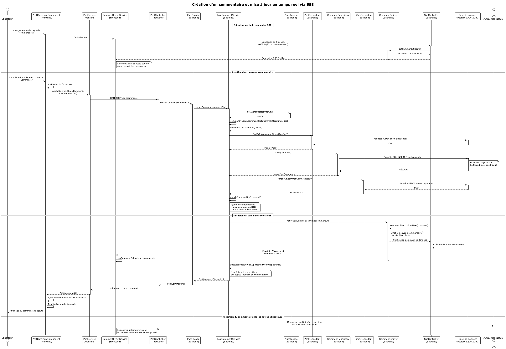

- Représentation simplifiée du flux SSE multi-utilisateurs :

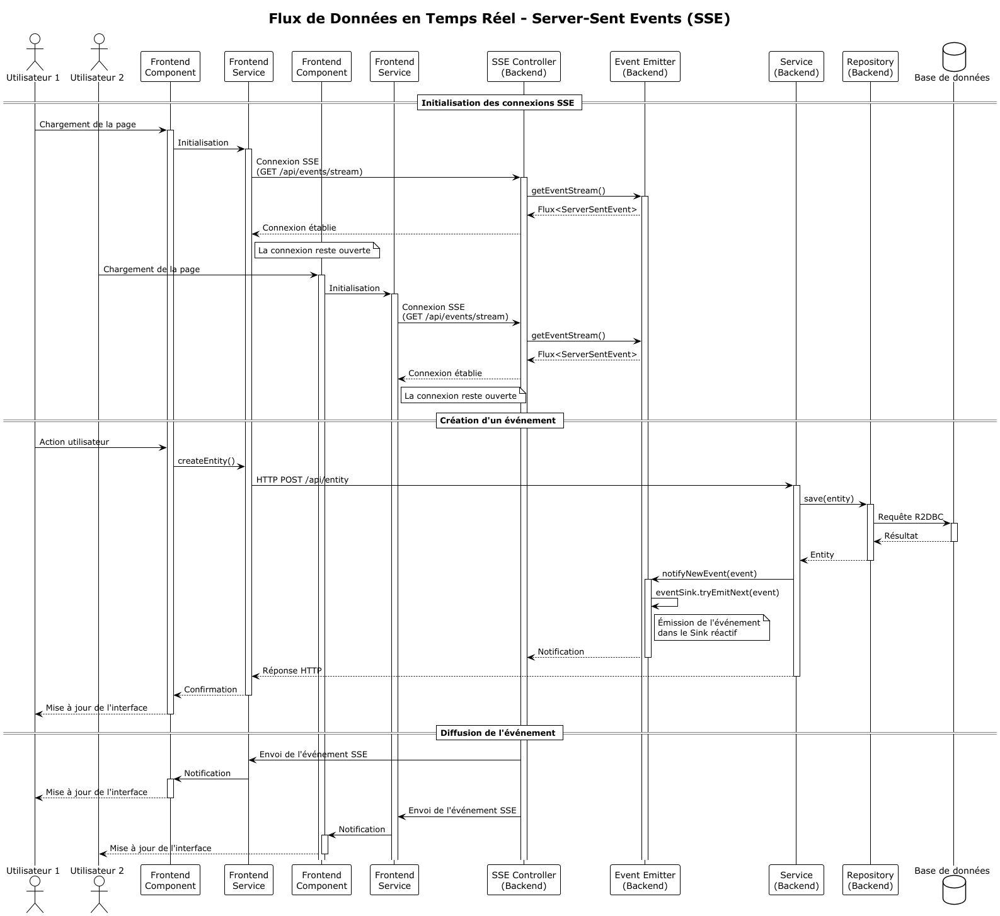

#### Sécurité basée sur OAuth2 et token

(Cf. [Dossier des choix techniques et d'architecture](https://veille.cpierres.dscloud.me/assets/pdf/choix-techniques-archi-mvp.pdf))


### Frontend avec Angular 19.2

- Full standalone components
- Mise en oeuvre de l'API Signal

### Bonnes pratiques

#### Gestion des messages, exceptions et erreurs

- transmission des messages backend selon différents niveaux de sévérité (erreur, warning, info, success)
- centralisation de la gestion des erreurs tant au niveau backend (via handler) que frontend (via Interceptor) ; permet rigueur et simplification de la gestion côté frontend.
- erreurs backend regroupées lorsque nécessaires (par exemple, double contrôle d'unicité sur email et username en une seule passe).
- response empaquetée avec requestId, timestamp (utile pour tracer l'aspect asynchrone et le traitement d'une requête dans une architecture micro-services)

Ergonomie :
- doubler certaines règles de gestion backend vers le frontend pour améliorer l'ergonomie 
  - contrôles de surface tels que validité du mot de passe côté backend et côté frontend pour un meilleur guidage et éviter du trafic réseau.


#### Respect rigoureux des principes SOLID

##### Backend (Spring Boot)

###### Single Responsibility Principle (SRP)
Le principe de responsabilité unique est bien respecté dans l'architecture backend :

- **Séparation claire des couches** : Le code est organisé en packages distincts (`controller`, `services`, `repositories`, `entities`, etc.) où chaque classe a une responsabilité unique.
- **Services spécialisés** : Les services sont divisés selon leurs responsabilités spécifiques :
  - `AuthenticationService` : Gère uniquement l'authentification des utilisateurs
  - `UserRegistrationService` : Responsable uniquement de l'enregistrement des utilisateurs
  - `UserProfileService` : Gère uniquement les profils utilisateurs
- **Façade pour simplifier l'accès** : La classe `AuthFacade` agit comme une façade qui délègue les appels aux services spécifiques, sans implémenter elle-même la logique métier.

###### Open/Closed Principle (OCP)
Le principe ouvert/fermé est respecté par :

- **Utilisation d'interfaces** : Les services sont définis par des interfaces (`IAuthenticationService`, `IUserRegistrationService`, `IUserProfileService`), permettant d'étendre les fonctionnalités sans modifier le code existant.
- **Architecture en couches** : L'architecture permet d'ajouter de nouvelles fonctionnalités sans modifier les composants existants.

###### Liskov Substitution Principle (LSP)
Le principe de substitution de Liskov est respecté par :

- **Implémentations cohérentes des interfaces** : Les classes comme `AuthenticationService` implémentent fidèlement les contrats définis par leurs interfaces, garantissant qu'elles peuvent être substituées sans affecter le comportement du programme.
- **Utilisation de types génériques** : L'utilisation de `Mono<T>` dans les signatures de méthodes permet une substitution cohérente des types de retour.

###### Interface Segregation Principle (ISP)
Le principe de ségrégation des interfaces est particulièrement bien appliqué :

- **Interfaces spécifiques** : Au lieu d'avoir une grande interface monolithique pour l'authentification, le code utilise trois interfaces distinctes :
  - `IAuthenticationService` : Méthodes liées à l'authentification
  - `IUserRegistrationService` : Méthodes liées à l'enregistrement
  - `IUserProfileService` : Méthodes liées à la gestion de profil
- **Interfaces ciblées** : Chaque interface ne contient que les méthodes nécessaires à sa responsabilité spécifique.

###### Dependency Inversion Principle (DIP)
Le principe d'inversion des dépendances est respecté par :

- **Injection de dépendances** : Utilisation systématique de l'injection de dépendances via les constructeurs.
- **Dépendances vers des abstractions** : Les classes dépendent d'interfaces plutôt que d'implémentations concrètes.
- **Configuration Spring** : L'utilisation de Spring facilite l'inversion de contrôle et l'injection de dépendances.

##### Frontend (Angular)

###### Single Responsibility Principle (SRP)
Le frontend respecte également le principe de responsabilité unique :

- **Architecture par fonctionnalités** : Organisation du code en dossiers par domaine fonctionnel (`auth`, `user`, `topic`, etc.).
- **Composants autonomes** : Chaque composant a une responsabilité unique :
    - `UserFormComponent` : Composant partagé responsable de l'affichage et de la validation du formulaire, selon 2 contextes
    - `RegisterComponent` : Gère l'inscription en activant les paramètres adéquats du composant `UserFormComponent`
    - `ProfilComponent` : Gère la mise à jour du profil en activant les paramètres adéquats du composant `UserFormComponent`
  
- **Services spécialisés** :
  - `AuthService` : Gère uniquement les opérations d'authentification
  - `ErrorHandlingService` : Responsable uniquement de la gestion des erreurs
  - `SessionService` : Gère uniquement l'état de la session utilisateur
  - `MessagesService` : Gère l'affichage des Messages dans un snackBar (basé sur Signal)

###### Open/Closed Principle (OCP)
Le principe ouvert/fermé est respecté par :

- **Architecture standalone** : L'utilisation de composants autonomes facilite l'extension sans modification.
- **Interfaces TypeScript** : Définition d'interfaces pour les modèles de données (`User`, `RegisterRequest`, etc.).
- **Séparation des préoccupations** : La séparation entre composants, services et interfaces permet d'étendre les fonctionnalités sans modifier le code existant.

###### Liskov Substitution Principle (LSP)
Le principe de substitution de Liskov est respecté par :

- **Utilisation cohérente des types** : Les interfaces TypeScript garantissent que les objets peuvent être substitués sans affecter le comportement.
- **Héritage approprié** : Les composants et services respectent les contrats définis par leurs interfaces.

###### Interface Segregation Principle (ISP)
Le principe de ségrégation des interfaces est respecté par :

- **Interfaces ciblées** : Chaque interface définit uniquement les propriétés nécessaires à son contexte d'utilisation.
- **Interfaces spécifiques** : Utilisation d'interfaces distinctes pour différents besoins :
  - `RegisterRequest` pour l'inscription
  - `LoginRequest` pour la connexion
  - `UserUpdate` pour la mise à jour du profil

###### Dependency Inversion Principle (DIP)
Le principe d'inversion des dépendances est respecté par :

- **Injection de dépendances Angular** : Utilisation du système d'injection de dépendances d'Angular.
- **Services injectables** : Les services sont déclarés avec `@Injectable()` et injectés dans les composants.
- **Dépendances vers des abstractions** : Les composants dépendent des interfaces des services plutôt que de leurs implémentations.

#### Conclusion

Le projet P6MDD respecte rigoureusement les principes SOLID tant au niveau du backend que du frontend :

1. **SRP** : Séparation claire des responsabilités dans les services, contrôleurs et composants.
2. **OCP** : Architecture extensible grâce aux interfaces et à la séparation des préoccupations.
3. **LSP** : Implémentations cohérentes des interfaces permettant la substitution.
4. **ISP** : Interfaces spécifiques et ciblées pour chaque besoin fonctionnel.
5. **DIP** : Utilisation systématique de l'injection de dépendances et de l'abstraction.

Cette adhérence aux principes SOLID contribue à la maintenabilité, l'extensibilité et la robustesse du code, facilitant ainsi les évolutions futures et la collaboration entre développeurs.

## Gestion centralisée des erreurs et des messages

Une bonne gestion des erreurs et des messages (centralisée) est indispensable.
Voici un diagramme qui illustre la gestion des erreurs et des messages entre le backend et le frontend :

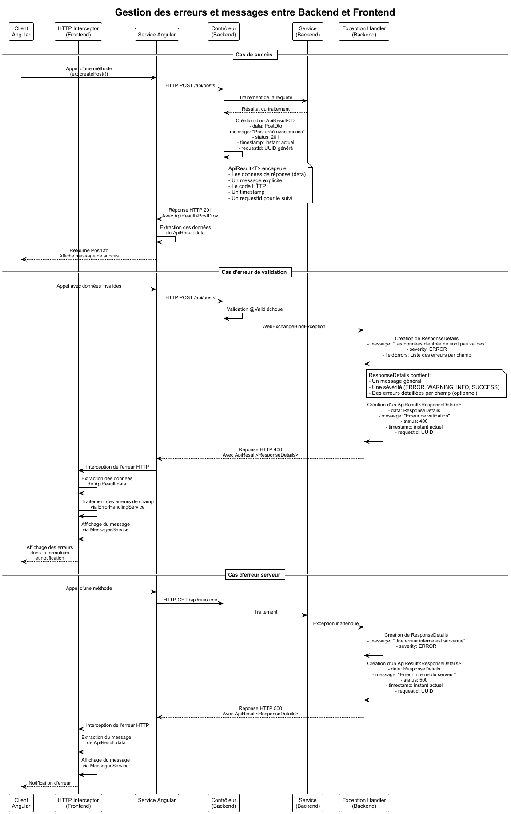

### Intérêt d'ApiResult

L'utilisation d'ApiResult dans l'architecture de l'application présente plusieurs avantages clés :

#### 1. Structure de réponse unifiée

ApiResult fournit une structure cohérente pour toutes les réponses API, qu'il s'agisse de succès ou d'erreurs. Cette uniformité simplifie le traitement côté client car toutes les réponses suivent le même format.

#### 2. Contenu riche et contextuel

ApiResult contient :
- **data** : Les données de la réponse (typées avec un générique `<T>`)
- **message** : Un message explicite décrivant le résultat
- **status** : Le code HTTP associé
- **timestamp** : L'horodatage précis de la réponse
- **requestId** : Un identifiant unique pour le suivi et le débogage

#### 3. Gestion sophistiquée des erreurs

Pour les erreurs, le champ `data` contient un objet `ResponseDetails` qui offre :
- Un message général d'erreur
- Un niveau de sévérité (ERROR, WARNING, INFO, SUCCESS)
- Une liste détaillée des erreurs par champ (pour les validations de formulaire)

#### 4. Traçabilité et débogage

Le `requestId` unique permet de suivre une requête à travers les différentes couches de l'application, ce qui est particulièrement utile dans une architecture microservices (si l'application évolue vers cette architecture) ou pour le débogage dans le cadre de Webflux (asynchronisme).

#### 5. Séparation des préoccupations

- Le backend peut fournir des messages techniques dans `message` et des messages utilisateur dans `data.message`
- Le frontend peut choisir d'afficher le message approprié selon le contexte

#### 6. Centralisation du traitement des erreurs

- Côté backend : Le `GlobalExceptionHandler` capture toutes les exceptions et les transforme en ApiResult
- Côté frontend : L'`errorInterceptor` intercepte toutes les erreurs HTTP et extrait les informations pertinentes

#### 7. Expérience utilisateur améliorée

Cette structure permet d'afficher des messages contextuels avec différents niveaux de sévérité, des erreurs de validation précises sur les champs de formulaire, et des notifications adaptées à chaque situation.

En résumé, ApiResult constitue un contrat clair entre le backend et le frontend, permettant une communication riche et structurée qui va au-delà des simples codes HTTP, tout en facilitant le traitement des erreurs et l'amélioration de l'expérience utilisateur.

## Scénarios destinés à mettre en valeur l'apport des technologies utilisées
Ces scénarios vous guident sur l'utilisation de l'application afin d'illustrer et commenter les apports techniques :
- mise à jour en temps réel de l'IHM pour tous les utilisateurs (un article ou un commentaire nouveau ainsi que les statistiques de popularité apparaissent instantanément pour tous les utilisateurs sans besoin d'actualiser le browser)
- messages des règles de gestion
- ergonomie

### Affichez l'application sur 2 navigateurs différents ainsi que sur votre téléphone mobile (avec des logins différents)

L'objectif sera de constater la mise à jour simultanée, ceci avec différents noms d'utilisateur.

- Affichez l'application depuis [https://mdd.cpierres.dscloud.me/](https://mdd.cpierres.dscloud.me/) sur un browser
  Chrome
- Affichez l'application depuis [https://mdd.cpierres.dscloud.me/](https://mdd.cpierres.dscloud.me/) sur un browser Edge
- Affichez l'application depuis [https://mdd.cpierres.dscloud.me/](https://mdd.cpierres.dscloud.me/) sur votre téléphone
  mobile

### Scénarios d'inscription et de connexions

#### Inscription via le browser Chrome

##### Scénario d'inscription avec erreurs de contrôle de surface et de backend (utilisateur u2 existe déjà)
- Cliquez sur le bouton `S'inscrire` :
- Dans un premier temps, saisissez volontairement un utilisateur qui existe déjà : email `u2@test.com` ainsi que le username : `u2`
  - Mettez à l'épreuve les contrôles de surface :
    - omettez la présence d'un `@` dans l'email par exemple,
    - le fait que les informations soient obligatoires,
    - Pour le mot de passe, saisissez dans un premier temps une valeur ne correspondant pas aux contraintes, par exemple : `Test`
  - Puis corrigez vos saisies
  - Pour que le mot de passe soit valide, saisissez par exemple `Test!1234`
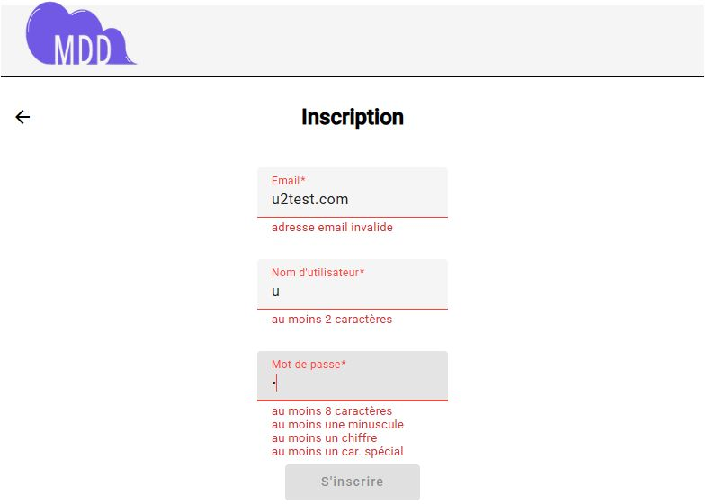

> **Note**
> Lorsque les contrôles de surface seront corrects, le bouton `S'inscrire` s'activera

- Cliquez sur le bouton `S'inscrire` 
- Maintenant que les contrôles de surface ont été validés, ce sont les contrôles `backend d'unicité` qui apparaissent :
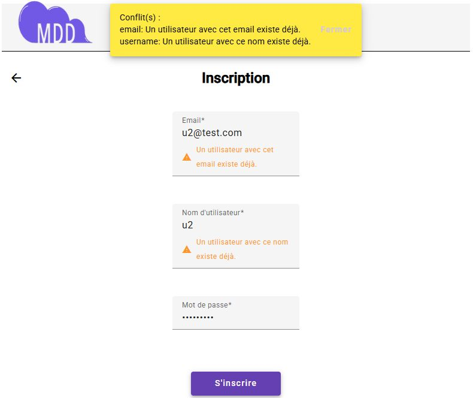
  - Notez que les deux contrôles d'unicité apparaissent en une seule passe (gérée sur le backend via `MultipleResourceAlreadyExistException` de type 409).
  - La bulle d'avertissement générale en haut d'écran s'effacera automatiquement après un laps de temps
    - La sévérité des messages est qualifiée via le backend et gérée automatiquement par le frontend d'une manière centralisée (via Interceptor et structure des erreurs toujours homogène) 
  - Les erreurs sous les champs s'effaceront dès lors qu'on corrige

#### Inscription de l'utilisateur `u1`
- Corrigez l'email en indiquant une valeur qui n'existe pas déjà ; pour la démo, indiquez `u1@test.com`
- Cliquez sur le bouton `S'inscrire`
- Corrigez la dernière erreur de contrôle d'unicité, en indiquant `u1` pour le username 
- Cliquez sur le bouton `S'inscrire`
- A la suite d'un enregistrement valide, l'utilisateur `u1` est directement connecté et arrive sur l'écran des Articles (Posts) : 
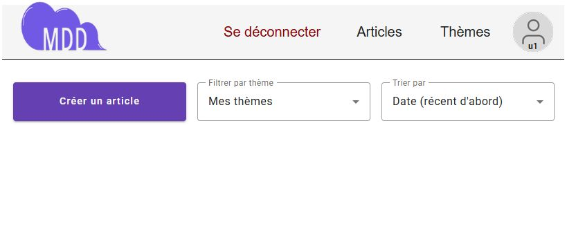

#### Connexion de l'utilisateur `u2` via le browser Edge
Pour la **deuxième connexion via Edge**, utilisez le username `u2` (qui existe déjà comme déjà vu).
- Cliquez sur le bouton `Se connecter`
> **Note**
> - Vous pouvez vous connecter aussi bien avec le username qu'avec son email.
> - Si vous faites une erreur sur le mot de passe ou bien sur le nom d'utilisateur, l'erreur affichée est volontairement vague afin de ne pas donner d'indication à un hacker.
  
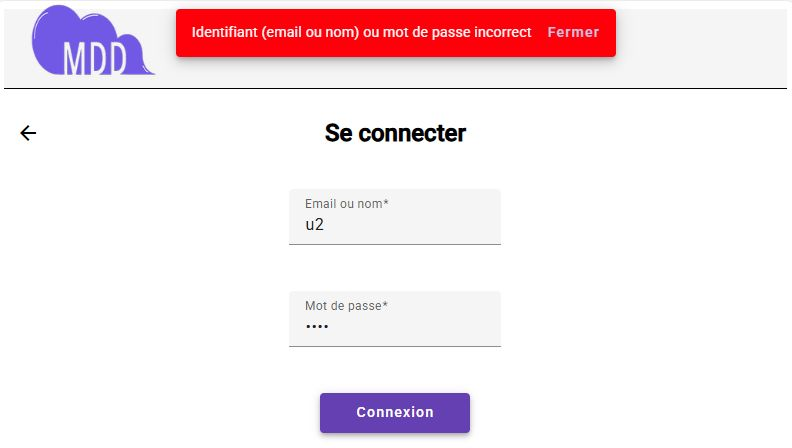

#### Disposez côte à côte le browser chrome de `u1` ainsi que le browser Edge de `u2`
- Voici u1 et u2 connectés dans deux browsers différents :

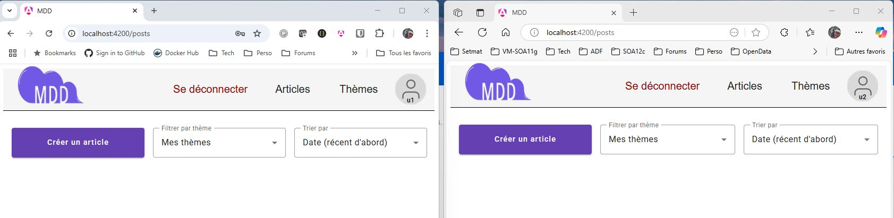

#### Enregistrez-vous également via votre téléphone mobile avec vos propres références (votre email et votre nom)

- puis affichez la page des Thèmes :

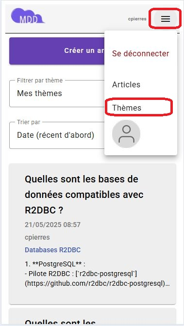 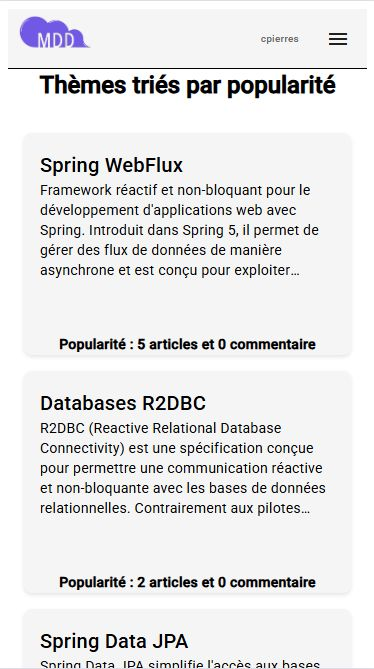 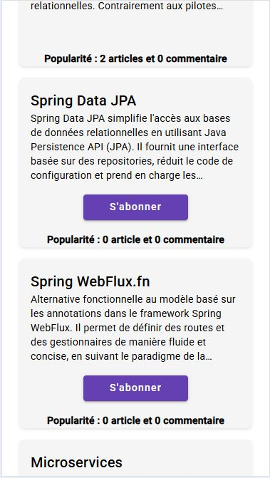

> **Note** 
> Pour ma part, je suis déjà abonné à plusieurs thèmes (faites en autant !)

### Scénarios d'abonnement / Désabonnement

#### u1 (Chrome) veut s'abonner au Thème `Spring Webflux` et `R2DBC`
- Comme vu dans les use-cases du dossier d'architecture, 
  - la page `Thèmes` présente les thèmes et permet de `S'abonner` 
  - la page `Profil` présente les Abonnements en cours et permet de `Se désabonner`
- Si vous cliquez sur le logo `Profil` alors que vous n'avez pas encore d'abonnements, vous avez un guidage qui vous dirige vers la page des Thèmes :
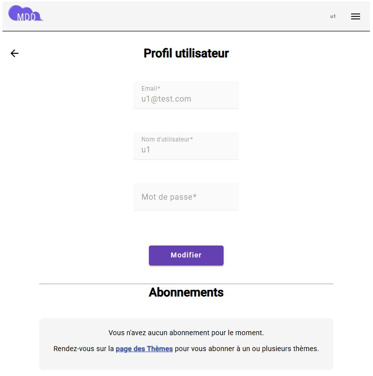
- Cliquez sur le lien [page de Thèmes](#thèmes) :
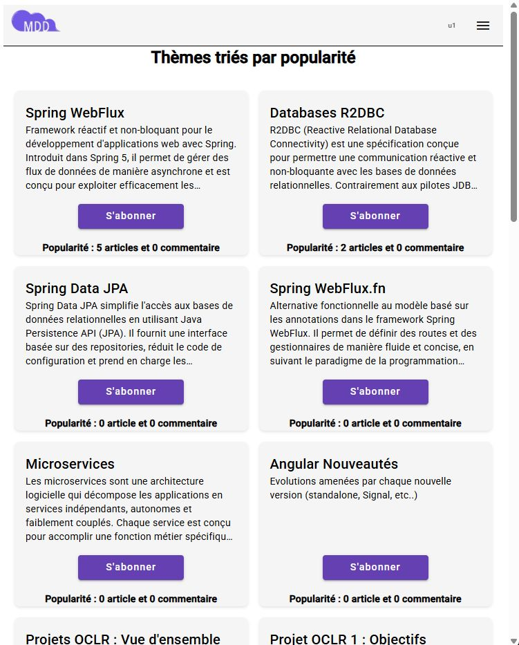
- Comme les descriptifs sont tronqués (avec des points de suite ...), vous pouvez cliquez sur le texte pour `zoomer` :
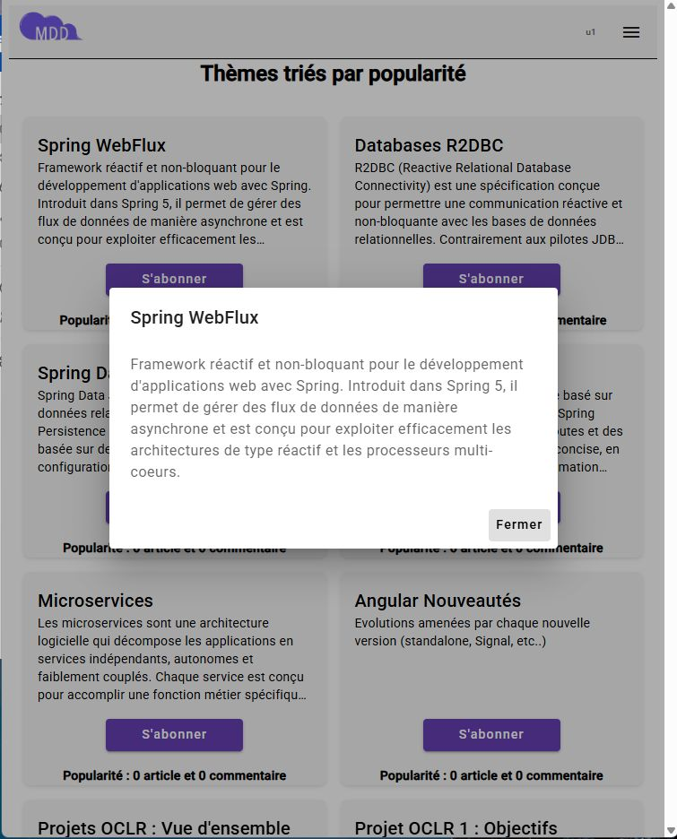
- Abonnez-vous à `Spring Webflux` et `R2DBC`

#### u1 (Chrome) veut se désabonner du Thème `R2DBC`
- Cliquez sur le logo `Profil`
> **Note**
> Les abonnements sont affichés en bas du Profil (c'est le comportement souhaité)
- Cliquez sur `Se désabonner` de RD2DBC

#### Modification du Profil username et du mot de passe
- Maintenant cliquez sur Modifier :
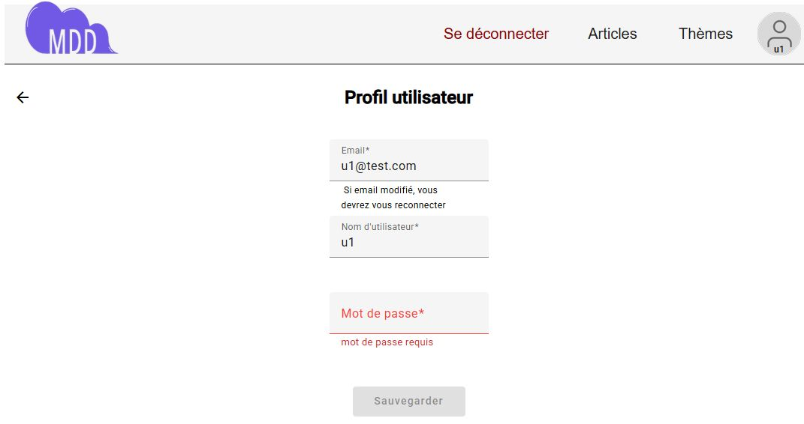
> **Note technique**
> Vous pouvez être étonné du message en dessous de l'email indiquant que si vous le modifiez, 
> vous devrez vous reconnecter. En fait, ce comportement a pour origine un problème de re-validation 
> du token qui devenait invalide côté Sécurité Spring comme sa signature ne correspondait plus (cette information 
> faisant partie du token). Depuis, j'ai corrigé le problème côté backend. Désormais on pourrait modifier
> l'email sans avoir besoin de se reconnecter ... mais je n'ai pas encore corrigé ce mauvais comportement 
> côté frontend (ceci sera fait dans la prochaine version).
> Cela donne l'occasion de voir comment on peut gérer un comportement fin dans l'IHM ! (Signal, effect ont été
> utilisés)
- Modifiez l'email ; vous constaterez que le libellé et le comportement du bouton de validation changent instantanément :
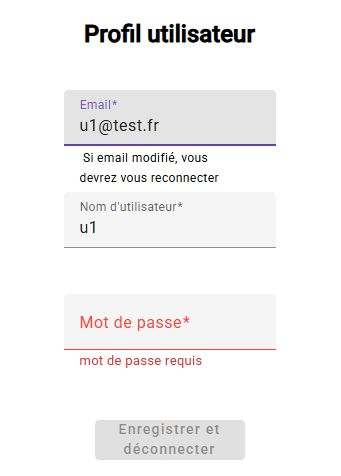
> **Note technique**
> La modification du profil et l'écran d'inscription sont deux pages qui partagent le même composant `user-form`
> avec deux comportements différents selon le contexte d'appel (profil ou register)
- Rétablissez l'email à sa valeur d'origine et vous constaterez que le libellé du bouton reviendra à son libellé d'origine
- Modifiez le username en ajoutant la lettre `b` à la fin par exemple
- Vous devrez modifier le Mot de passe pour que le bouton `Sauvegarder` puisse s'activer :
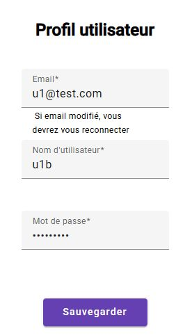
- Après sauvarde, affichage d'un snackbar de success :
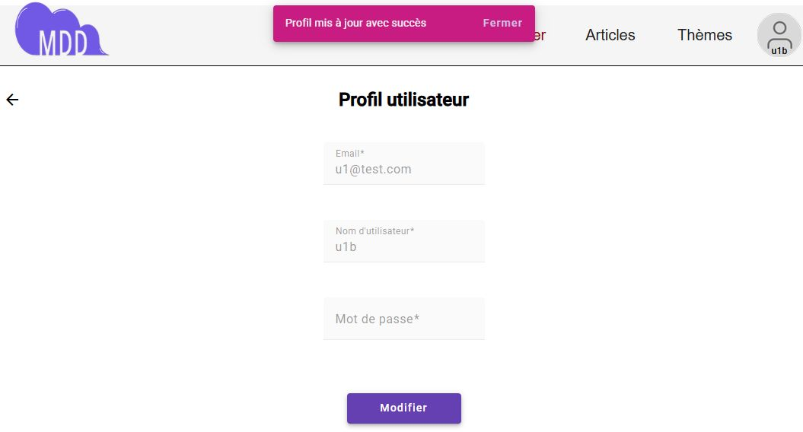
> **Note**
> La bulle `snackBar` de success s'affiche 2 secondes (`MessagesService` shared basé sur Signal)


#### u2 (Edge) veut s'abonner au Thème `Spring Webflux`
- Cliquez sur `Thèmes` puis sur `S'abonner` (rester sur cet écran)

### Création d'Articles (Posts) et de Commentaires

#### u1 affiche les Articles
> **Note**
> Par défaut, seuls les articles concernant les thèmes auxquels l'utilisateur s'est abonné sont affichés.
> Testez les capacités de Filtre et de Tri. Revenir au tri par défaut : `Date (récent d'abord)` avant de passer à la suite.

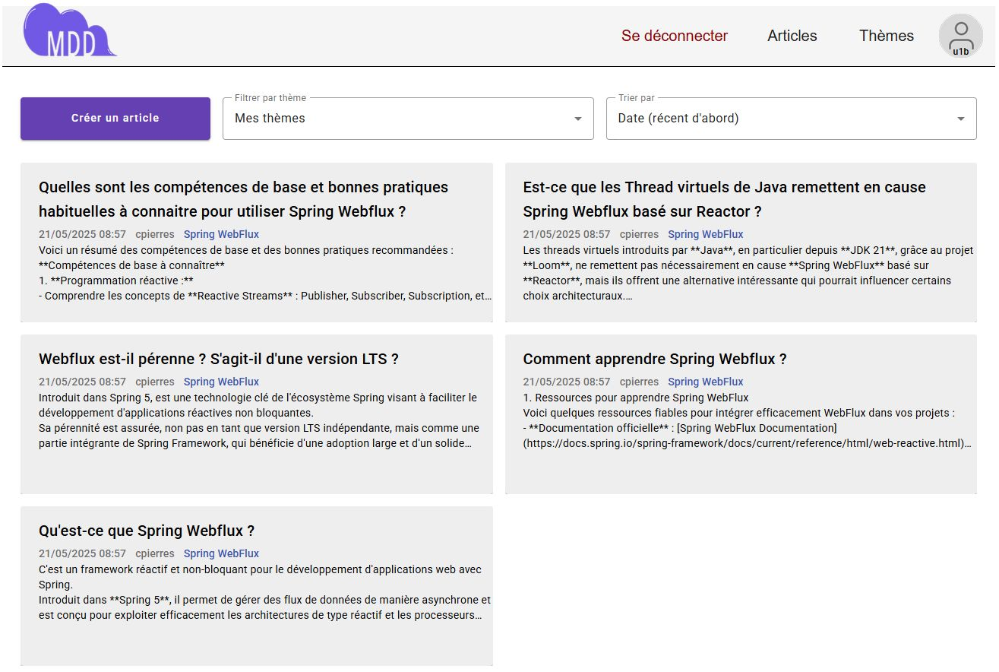

#### u1 crée un article pour le Thème `Spring Webflux`
- Cliquez sur le bouton `Créer un article`
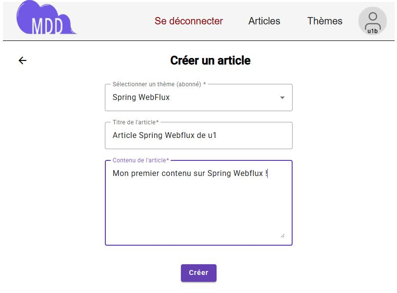

- Une fois les données saisies, cliquez sur le bouton `Créer`
> **Note**
> Au retour vers la liste, le compteur des articles (popularité) de u2 est instantanément actualisé (ainsi que sur votre mobile)

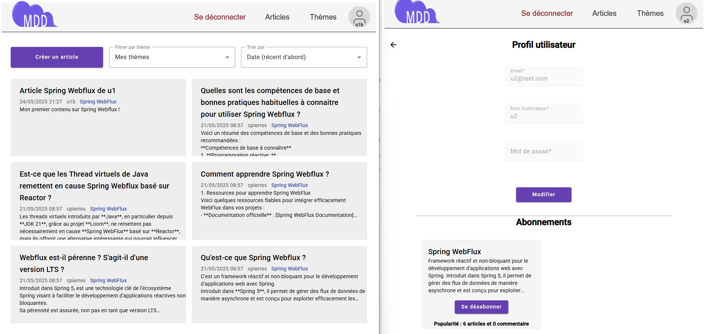

#### u2 crée un article pour le Thème `Spring Webflux` à son tour
- Cliquez sur le bouton `Créer un article`


- Saisissez des données :

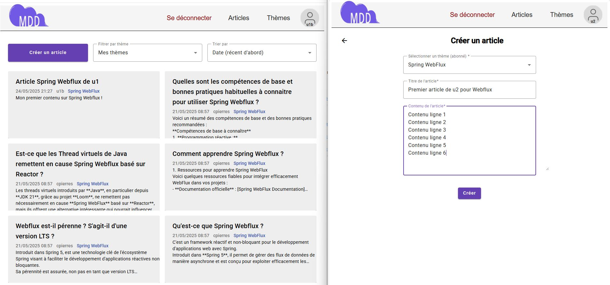

- Cliquez sur le bouton `Créer` pour valider

> **Note**
> Dès la sauvegarde, l'article de u2 est affiché sur tous les browsers et dans le bon ordre de tri

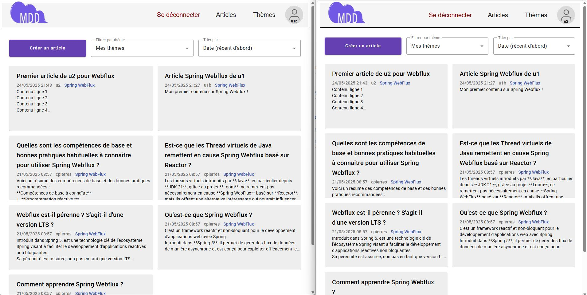

#### u1 va créer un commentaire sur le nouvel article de u2 ; u2 affiche le détail de son article
- affichez sur le mobile, la page des Topics (pour voir les compteurs de popularité)

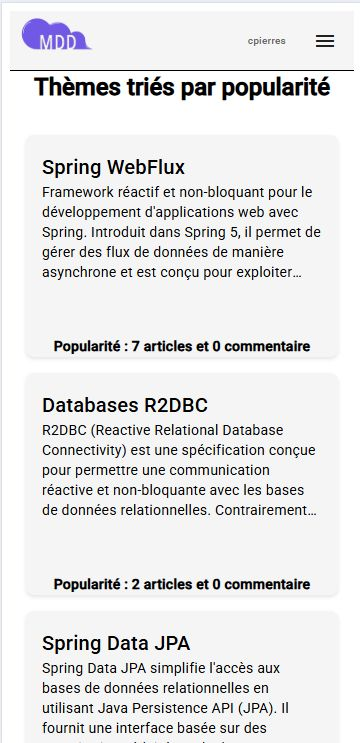

- u1 clique sur le nouvel article de u2
- u2 affiche aussi le détail de son propre article
- u1 commence à saisir un commentaire :
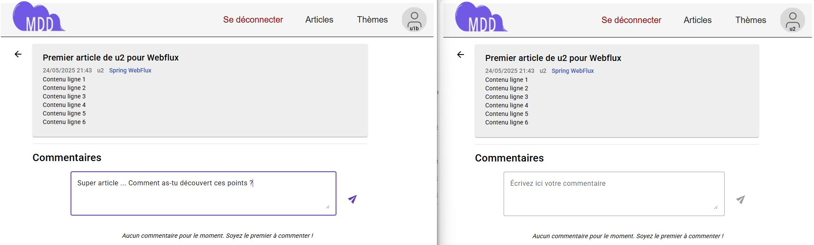


- u1 envoie le commentaire
> **Note**
> Dès la sauvegarde, tous les terminaux sont mis simultanément à jour :

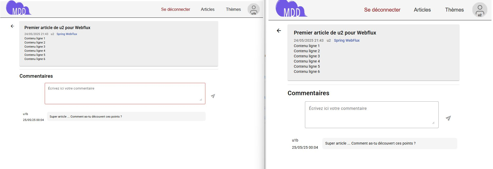

> **Note**
> Le compteur est également mis à jour instantanément sur le mobile :

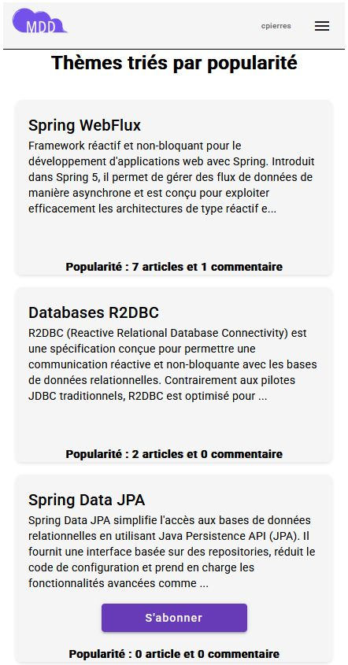

#### u2 va répondre à u1 dans le fil de commentaire de son article ; une conversation s'engage (visible par tous les utilisateurs)

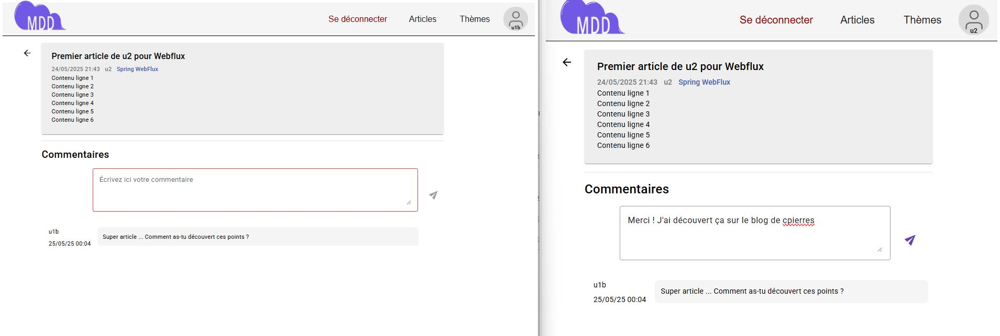

> **Note**
> Chaque utilisateur découvre le commentaire de l'autre instantanément !
> De quoi engager une conversation à 2 ou à plusieurs ...

Par ailleurs, si sur le mobile, vous affichez la page des Articles et que vous regardez à ce moment-là la liste des filtres, la popularité s'actualisera également sous vos yeux !


## Détails de l'architecture de sécurité

L'architecture globale de sécurité est décrite dans le : [Dossier des choix techniques et d'architecture](https://veille.cpierres.dscloud.me/assets/pdf/choix-techniques-archi-mvp.pdf)

Quelques précisions ici concernant le fait que l'application est autonome sur la sécurité.

### Serveur d'autorisation vs Serveur de ressources dans OAuth 2.0

#### Distinction conceptuelle dans OAuth 2.0

Dans l'architecture OAuth 2.0, le **serveur d'autorisation** et le **serveur de ressources** sont deux composants conceptuellement distincts avec des responsabilités différentes :

1. **Serveur d'autorisation** :
  - Authentifie les utilisateurs
  - Émet des tokens d'accès (JWT dans notre cas)
  - Gère les informations d'identification des utilisateurs
  - Implémente les endpoints d'authentification (login, register)

2. **Serveur de ressources** :
  - Valide les tokens d'accès reçus dans les requêtes
  - Protège les ressources (API, données)
  - Autorise ou refuse l'accès aux ressources en fonction de la validité du token
  - Implémente la logique de vérification des tokens

#### Implémentation dans Spring Security

Dans Spring Boot avec Spring Security, ces deux composants peuvent être implémentés de différentes manières :

1. **Serveur d'autorisation** :
  - `spring-boot-starter-oauth2-authorization-server` (nouveau module)
  - Ou : Implémentation personnalisée (comme dans notre projet)

2. **Serveur de ressources** :
  - `spring-boot-starter-oauth2-resource-server` (ce que nous utilisons)
  - Configuration via `.oauth2ResourceServer(oauth2 -> oauth2.jwt(...))`

#### Configuration dans P6MDD (Serveur autonome)

Dans notre projet P6MDD, nous avons une architecture de **serveur de ressources OAuth2 autonome** où :

1. Nous utilisons `oauth2ResourceServer` pour configurer l'application comme un serveur de ressources :
   ```
   .oauth2ResourceServer(oauth2 -> oauth2.jwt(Customizer.withDefaults()))
   ```

2. Nous implémentons également notre propre logique de serveur d'autorisation :
  - `JwtService` pour générer les tokens JWT
  - Endpoints `/api/auth/login` et `/api/auth/register` pour l'authentification
  - `AuthenticationService` pour la validation des identifiants


- `oauth2ResourceServer` configure spécifiquement la partie **serveur de ressources** de l'architecture
- La logique de **serveur d'autorisation** est implémentée manuellement dans notre application

Dans notre projet, nous avons choisi d'implémenter ces deux composants dans la même application, ce qui est une approche valide et courante pour les applications autonomes.
Cette approche "tout-en-un" est appelée "serveur de ressources OAuth2 autonome".

#### Avantages de cette approche

1. **Simplicité** : Une seule application à déployer et à maintenir
2. **Cohérence** : Utilisation de la même clé secrète pour la génération et la validation des tokens
3. **Contrôle** : Personnalisation complète du processus d'authentification
4. **Performance** : Pas de communication réseau entre le serveur d'autorisation et le serveur de ressources

#### Alternatives possibles

1. **Serveurs séparés** : Déployer un serveur d'autorisation dédié (comme Keycloak) et configurer notre application uniquement comme serveur de ressources
2. **Utilisation d'un fournisseur externe** : Utiliser un service d'authentification tiers
3. **Spring Authorization Server** : Utiliser le nouveau module `spring-boot-starter-oauth2-authorization-server` pour une implémentation standard

#### Conclusion

`oauth2ResourceServer` est une configuration qui implémente spécifiquement la partie **serveur de ressources** de l'architecture OAuth 2.0. Dans notre projet, nous avons également implémenté manuellement la partie **serveur d'autorisation**, créant ainsi une solution complète et autonome.

Les deux composants (serveur d'autorisation et serveur de ressources) sont des concepts distincts dans l'architecture OAuth 2.0, mais ils peuvent être implémentés ensemble dans la même application, comme c'est le cas dans notre projet P6MDD.


### Utilité de la dépendance `spring-security-oauth2-jose` dans le projet P6MDD

#### Introduction

La dépendance `spring-security-oauth2-jose` est une composante essentielle de l'architecture de sécurité du projet P6MDD.
Elle fournit les fonctionnalités nécessaires pour manipuler les tokens JWT (JSON Web Tokens) dans le contexte d'une application configurée comme serveur de ressources OAuth2.

```xml
<dependency>
    <groupId>org.springframework.security</groupId>
    <artifactId>spring-security-oauth2-jose</artifactId>
</dependency>
```

#### Qu'est-ce que JOSE ?

JOSE (JSON Object Signing and Encryption) est un ensemble de spécifications qui standardisent la façon dont les objets JSON sont signés et chiffrés. Ces spécifications comprennent :

- **JWT (JSON Web Token)** : Format pour représenter des claims de manière sécurisée entre deux parties
- **JWS (JSON Web Signature)** : Mécanisme pour signer des données avec une signature numérique
- **JWE (JSON Web Encryption)** : Mécanisme pour chiffrer des données
- **JWK (JSON Web Key)** : Format pour représenter des clés cryptographiques
- **JWA (JSON Web Algorithms)** : Algorithmes cryptographiques utilisés dans les spécifications ci-dessus

#### Rôle dans l'architecture OAuth2

Dans l'architecture OAuth2, les tokens JWT sont couramment utilisés comme tokens d'accès pour :

1. **Authentifier** les utilisateurs
2. **Autoriser** l'accès aux ressources protégées
3. **Transmettre des informations** sur l'utilisateur et ses droits

La dépendance `spring-security-oauth2-jose` fournit les outils nécessaires pour :

- **Générer** des tokens JWT (côté serveur d'autorisation)
- **Valider** des tokens JWT (côté serveur de ressources)
- **Extraire des informations** des tokens JWT

#### Classes et fonctionnalités principales

Dans le projet P6MDD, plusieurs classes fournies par cette dépendance sont utilisées :

##### 1. `NimbusJwtEncoder`

Cette classe est utilisée pour créer et signer des tokens JWT. Elle est configurée dans `SecurityConfig` :

```java
@Bean
public JwtEncoder jwtEncoder(JwtService jwtService) {
    return new NimbusJwtEncoder(new ImmutableSecret<>(jwtService.getSecretKey()));
}
```

##### 2. `NimbusReactiveJwtDecoder`

Cette classe est utilisée pour valider et décoder les tokens JWT dans un contexte réactif. Elle est configurée dans `SecurityConfig` :

```java
@Bean
public ReactiveJwtDecoder reactiveJwtDecoder(JwtService jwtService) {
    return NimbusReactiveJwtDecoder
            .withSecretKey(jwtService.getSecretKey()).build();
}
```

##### 3. `ImmutableSecret`

Cette classe représente une clé secrète immuable utilisée pour signer et valider les tokens JWT. 
Elle est utilisée dans la configuration de `NimbusJwtEncoder`.

#### Intégration dans le système de sécurité

La dépendance `spring-security-oauth2-jose` est intégrée dans le système de sécurité du projet P6MDD de la manière suivante :

##### 1. Configuration du serveur de ressources OAuth2

Dans la méthode `securityWebFilterChain` de la classe `SecurityConfig` :

```
return http
        // autres configurations...
        .oauth2ResourceServer(oauth2 -> oauth2.jwt(Customizer.withDefaults()))
        .build();
```

Cette configuration indique à Spring Security que l'application doit agir comme un serveur de ressources OAuth2 qui valide les tokens JWT.

##### 2. Génération des tokens JWT

Dans le service `JwtService`, les tokens JWT sont générés en utilisant la bibliothèque `io.jsonwebtoken` :

```java
public String generateToken(UUID id, String username) {
    return Jwts.builder()
            .setSubject(username)
            .claim("id", id)
            .setIssuedAt(new Date())
            .setExpiration(new Date(System.currentTimeMillis() + JWT_EXPIRATION_TIME * 1000))
            .signWith(SECRET_KEY)
            .compact();
}
```

##### 3. Validation des tokens JWT

La validation des tokens JWT est gérée automatiquement par Spring Security grâce à la configuration du serveur de ressources OAuth2 et du décodeur JWT.

#### Architecture "serveur de ressources OAuth2 autonome"

Le projet P6MDD utilise une architecture de "serveur de ressources OAuth2 autonome" où l'application joue à la fois le rôle de :

1. **Serveur d'autorisation** : Responsable de l'authentification des utilisateurs et de l'émission des tokens JWT
2. **Serveur de ressources** : Responsable de la validation des tokens JWT et de la protection des ressources

La dépendance `spring-security-oauth2-jose` est essentielle pour cette architecture car elle fournit les outils nécessaires pour la manipulation des tokens JWT des deux côtés.

#### Avantages de l'utilisation de `spring-security-oauth2-jose`

1. **Sécurité renforcée** : Implémentation robuste des spécifications JOSE
2. **Intégration transparente** avec Spring Security
3. **Support des standards** : Conformité aux spécifications JWT, JWS, JWE, JWK et JWA
4. **Flexibilité** : Support de différents algorithmes de signature et de chiffrement
5. **Performance** : Implémentation optimisée pour les applications Spring Boot

#### Conclusion

La dépendance `spring-security-oauth2-jose` joue un rôle important dans l'architecture de sécurité du projet P6MDD en fournissant les fonctionnalités nécessaires pour la manipulation des tokens JWT dans le contexte OAuth2. Elle permet à l'application de fonctionner à la fois comme serveur d'autorisation et serveur de ressources, offrant ainsi une solution de sécurité complète et autonome.

## Instructions pour le DevOps (maven) et la gestion des commits (gitflow) 

Cette section décrit les aspects DevOps du projet P6MDD, notamment la gestion Maven centralisée et les pratiques GitFlow recommandées.

### Gestion Maven centralisée

Le projet P6MDD utilise une architecture Maven multi-modules qui centralise la configuration et la gestion des dépendances :

#### Structure des modules

- p6mdd/
  - pom.xml : POM parent qui définit la structure globale
  - modules/
    - back/ : Module backend Spring Boot
      - pom.xml : POM du backend qui hérite du parent
    - front/ : Module frontend Angular
      - pom.xml : POM du frontend qui hérite du parent

#### Avantages de cette approche

- **Gestion centralisée des versions** : Les versions des dépendances et des plugins sont définies dans le POM parent
- **Cohérence entre modules** : Tous les modules partagent les mêmes versions de dépendances
- **Profils de build unifiés** : Les profils (`dev`, `prodlocal`, `prodnas`) sont définis au niveau parent
- **Déploiement simplifié** : Un seul point d'entrée pour construire l'ensemble de l'application

#### Commandes Maven principales

```bash
# Construction complète du projet (tous les modules)
mvn clean install

# Construction avec un profil spécifique
mvn clean install -P prodlocal

# Construction et génération des images Docker
mvn clean install -P prodlocal,docker-image
```

### Directives GitFlow

Le projet est configuré pour suivre le workflow GitFlow, une méthodologie de gestion de branches qui facilite le développement parallèle et les releases.

#### Initialisation de GitFlow dans le projet

Pour initialiser GitFlow dans un dépôt existant :

```bash
# Se positionner à la racine du projet
cd p6mdd

# Initialiser GitFlow avec les paramètres par défaut
git flow init -d

# Ou initialiser avec des paramètres personnalisés
git flow init
```

#### Branches principales

- **`main`** : Code en production, stable
- **`develop`** : Branche d'intégration pour le développement

#### Gestion des features

Pour développer une nouvelle fonctionnalité :

```bash
# Création d'une branche de feature depuis develop
git flow feature start nom-de-la-feature

# Développement de la fonctionnalité avec commits réguliers
git add .
git commit -m "Description des changements"

# Mise à jour régulière avec develop
git checkout develop
git pull
git checkout feature/nom-de-la-feature
git merge develop

# Une fois la feature terminée, fusion dans develop
git flow feature finish nom-de-la-feature
```

#### Création d'une release

Pour préparer une nouvelle version :

```bash
# Création d'une branche de release depuis develop
git flow release start x.y.z

# Corrections de bugs spécifiques à la release
git add .
git commit -m "Correction pour la release x.y.z"

# Finalisation de la release
git flow release finish x.y.z
```

Cette commande effectue automatiquement :
- La fusion de la branche release dans main
- La création d'un tag avec la version
- La fusion de la branche release dans develop
- La suppression de la branche release

#### Gestion des hotfixes

Pour corriger un bug critique en production :

```bash
# Création d'une branche hotfix depuis main
git flow hotfix start x.y.z+1

# Correction du bug
git add .
git commit -m "Fix: description du correctif"

# Finalisation du hotfix
git flow hotfix finish x.y.z+1
```

Cette commande effectue automatiquement :
- La fusion du hotfix dans main
- La création d'un tag avec la version
- La fusion du hotfix dans develop
- La suppression de la branche hotfix

### Intégration GitFlow et Maven

Le projet P6MDD combine GitFlow et Maven pour une gestion efficace des versions et des déploiements :

#### Configuration du plugin maven-release-plugin

Le POM parent inclut la configuration du `maven-release-plugin` qui facilite la gestion des versions :

```xml
<plugin>
    <groupId>org.apache.maven.plugins</groupId>
    <artifactId>maven-release-plugin</artifactId>
    <version>3.0.1</version>
    <configuration>
        <tagNameFormat>v@{project.version}</tagNameFormat>
        <autoVersionSubmodules>true</autoVersionSubmodules>
        <releaseProfiles>release</releaseProfiles>
    </configuration>
</plugin>
```

Cette configuration permet :
- De créer automatiquement des tags Git avec le format `vX.Y.Z`
- De mettre à jour les versions de tous les sous-modules
- D'activer le profil `release` lors de la création d'une release

#### Workflow de release complet avec GitFlow et Maven

1. **Préparation** :
   ```bash
   # Création d'une branche de release
   git flow release start x.y.z
   ```

2. **Mise à jour des versions** :
   ```bash
   # Mise à jour des versions dans les POM
   mvn versions:set -DnewVersion=x.y.z
   git add .
   git commit -m "Version bump to x.y.z"
   ```

3. **Exécution de la release Maven** :
   ```bash
   # Sur la branche release/x.y.z
   mvn release:prepare
   mvn release:perform
   ```

4. **Finalisation de la release GitFlow** :
   ```bash
   git flow release finish x.y.z
   ```

5. **Publication des tags et branches** :
   ```bash
   git push origin develop
   git push origin main
   git push origin --tags
   ```

#### Déploiement continu

Le projet est configuré pour faciliter le déploiement continu avec Docker :

- **Images Docker** : Générées automatiquement via le profil `docker-image`
- **Orchestration** : Utilisation de `docker-compose` pour déployer l'ensemble de la stack
- **Environnements** : Configuration spécifique pour chaque environnement via les fichiers `.env.*`

Pour déployer l'application en environnement local de production :

```bash
# Construction des images
mvn clean install -P prodlocal,docker-image

# Déploiement
docker-compose --env-file .env.prodlocal -f docker-compose.prodlocal.yml -p p6-mdd-prodlocal up -d
```

#### Bonnes pratiques GitFlow pour le projet

1. **Toujours utiliser les commandes GitFlow** plutôt que les commandes Git standard pour les opérations liées au workflow
2. **Ne jamais modifier directement les branches `main` et `develop`**
3. **Créer des branches de feature pour chaque nouvelle fonctionnalité**
4. **Utiliser des branches de release pour préparer les versions**
5. **Utiliser des branches de hotfix pour les corrections urgentes en production**
6. **Toujours mettre à jour les versions dans les POM avant de finaliser une release**
7. **Exécuter les tests avant de finaliser une feature, une release ou un hotfix**
8. **Documenter les changements dans un fichier CHANGELOG.md**


## Auteur et contexte
- Auteur : Christophe Pierrès
- Dans le cadre du projet N°6 d'OpenClassrooms, en vue d'obtenir la certification
  **Expert en développement logiciel**. Plus d'informations
  disponibles [ici](https://www.francecompetences.fr/recherche/rncp/36912/) et dans la section `About me` de mon site de veille technologique : https://veille.cpierres.dscloud.me/

